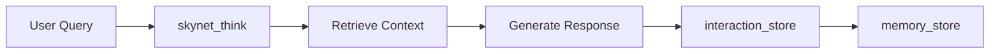

<div align="center">

# 🌌 Skynet MCP Server


### *Advanced Model Context Protocol server with persistent memory*

**Powered by Memgraph (Graph DB) 🔗 & ChromaDB (Vector DB) 🧠**

---

[](https://patgpt.github.io/skynet/)
[](#testing)
[](#production)
[](https://github.com/patgpt/skynet/releases)
[](LICENSE)

<!-- Tech Stack Badges -->
<p>
	<a href="https://bun.sh"></a>
	<a href="https://www.typescriptlang.org/"></a>
	<a href="https://biomejs.dev/"></a>
	<a href="https://vitepress.dev/"></a>
	<a href="https://memgraph.com/"></a>
	<a href="https://www.trychroma.com/"></a>
</p>

[🚀 Quick Start](#-quick-start) • [📖 Documentation](https://patgpt.github.io/skynet/) • [🛠️ Tools](#-tools-18-total) • [🤝 Contributing](CONTRIBUTING.md)

</div>

---

## ✨ Features

<table>
<tr>
<td width="50%">

### 🧠 **Intelligent Memory**
- Semantic search with ChromaDB
- Graph-based relationships via Memgraph
- Persistent conversation context

</td>
<td width="50%">

### ⚡ **High Performance**
- Built with Bun runtime
- 3.9MB optimized bundle
- Tree-shaking & minification

</td>
</tr>
<tr>
<td width="50%">

### 🔧 **Developer Friendly**
- 18 specialized MCP tools
- Full TypeScript support
- Comprehensive test coverage

</td>
<td width="50%">

### 🐳 **Easy Deployment**
- Docker Compose ready
- One-command setup
- GitHub Pages docs

</td>
</tr>
</table>

---

## 🚀 Quick Start

```bash
# 1️⃣ Install dependencies
bun install

# 2️⃣ Start databases (Docker required)
docker-compose up -d

# 3️⃣ Development with hot-reload
bun dev

# 4️⃣ Run tests
bun test

# 5️⃣ Build for production
bun run build
```

<details>
<summary>📦 <b>Installing from npm / GitHub Packages</b></summary>

#### From npm (recommended)
```bash
npx @patgpt/skynet
```

#### From GitHub Packages
```bash
npx --registry=https://npm.pkg.github.com @patgpt/skynet
```

#### Install globally
```bash
# From npm
npm install -g @patgpt/skynet

# From GitHub Packages
npm install -g --registry=https://npm.pkg.github.com @patgpt/skynet
```

</details>

<details>
<summary>📦 <b>Installing from Release</b></summary>

```bash
# Download latest release
wget https://github.com/patgpt/skynet/releases/latest/download/skynet-v1.0.0.tar.gz

# Extract and install
tar -xzf skynet-v1.0.0.tar.gz
cd skynet-v1.0.0
bun install --production
docker-compose up -d
bun run dist/index.js
```

</details>

---

## 📚 Documentation

> 📘 **Comprehensive documentation available at [patgpt.github.io/skynet](https://patgpt.github.io/skynet/)**

### 🔗 Quick Links

| Section | Description |
|---------|-------------|
| [🏁 Getting Started](https://patgpt.github.io/skynet/guide/) | Installation and first steps |
| [🏗️ Architecture](https://patgpt.github.io/skynet/guide/architecture) | System design and workflows |
| [📘 API Reference](https://patgpt.github.io/skynet/api/) | Complete API documentation |
| [🛠️ Tools Overview](https://patgpt.github.io/skynet/guide/tools) | All 15 tools explained |

<details>
<summary>🖥️ <b>Local Documentation</b></summary>

```bash
# Install dependencies
bun install

# Run documentation locally
bun run docs:dev

# Build documentation
bun run docs:build

# Generate TypeDoc API docs
bun run docs:api
```

</details>

---

## 🛠️ Tools (15 total)

<details open>
<summary><b>🏗️ Infrastructure (3 tools)</b></summary>

| Tool | Description |
|------|-------------|
| `stack_up` | 🚀 Start Memgraph & ChromaDB containers |
| `stack_down` | 🛑 Stop containers gracefully |
| `stack_status` | 📊 Check container health status |

</details>

<details open>
<summary><b>💾 Database (3 tools)</b></summary>

| Tool | Description |
|------|-------------|
| `graph_query` | 🔍 Execute Cypher queries on Memgraph |
| `chroma_query` | 🔎 Semantic search in ChromaDB |
| `chroma_add` | ➕ Add documents to ChromaDB |

</details>

<details open>
<summary><b>🧠 Memory (2 tools)</b></summary>

| Tool | Description |
|------|-------------|
| `memory_store` | 💾 Store semantic memories with metadata |
| `memory_search` | 🔍 Search memories by semantic query |

</details>

<details open>
<summary><b>👥 Interactions (6 tools)</b></summary>

| Tool | Description |
|------|-------------|
| `interaction_store` | 📝 Store user interactions in graph |
| `interaction_getContext` | 📜 Get user conversation history |
| `interaction_findRelated` | 🔗 Find related interactions |
| `user_getProfile` | 👤 Get/create user profile |
| `graph_createRelationship` | 🔗 Link interactions together |
| `analytics_getInsights` | 📊 Analyze conversation patterns |

</details>

<details open>
<summary><b>🤖 Cognitive (1 tool)</b></summary>

| Tool | Description |
|------|-------------|
| `skynet_think` | 💭 Process input & retrieve context |

</details>

> 📖 **See [Tools Overview](https://patgpt.github.io/skynet/guide/tools) for detailed documentation**

---

## 📁 Project Structure

```
skynet/
├── 📂 src/
│   ├── 📄 index.ts              # Main entry point
│   ├── 📄 types.ts              # TypeScript definitions
│   ├── 📂 db/                   # Database clients
│   │   ├── memgraph.ts          # Graph DB (Memgraph)
│   │   ├── chroma.ts            # Vector DB (ChromaDB)
│   │   └── docker.ts            # Docker client
│   └── 📂 tools/                # MCP tool implementations
│       ├── infrastructure.ts    # Container management (3 tools)
│       ├── database.ts          # DB access (3 tools)
│       ├── memory.ts            # Semantic memory (2 tools)
│       ├── interactions.ts      # User tracking (6 tools)
│       └── cognitive.ts         # Skynet workflow (1 tool)
├── 📂 tests/                    # Test suite (Bun)
├── 📂 docs/                     # VitePress documentation
│   ├── .vitepress/config.ts     # VitePress config
│   ├── guide/                   # User guides
│   ├── api/                     # API reference
│   └── api-generated/           # TypeDoc output
└── 📂 dist/                     # Production build
```

---

## 🏗️ Architecture



### 🗄️ **Databases**

| Database | Purpose | Port |
|----------|---------|------|
| **Memgraph** 🔗 | Graph database for interaction relationships | 7687 |
| **ChromaDB** 🧠 | Vector database for semantic memory | 8000 |

### 🔄 **Workflow**

1. **User Query** → `skynet_think` (retrieve context)
2. **Process** query with historical context
3. **Generate** intelligent response
4. **Store** → `interaction_store` (persist conversation state)
5. **Enrich** → `memory_store` (capture durable insights)

> 🔍 **See [Architecture Guide](https://patgpt.github.io/skynet/guide/architecture) for detailed diagrams**

---

## 💻 Development

```bash
bun dev            # 🔥 Hot-reload development
bun test           # ✅ Run tests
bun test:watch     # 👀 Watch mode
bun run typecheck  # 🔍 Type checking only
```

### 📖 Documentation Development

```bash
bun run docs:dev     # 🌐 Start VitePress dev server
bun run docs:build   # 🏗️ Build static site
bun run docs:preview # 👁️ Preview built site
bun run docs:api     # 📚 Generate TypeDoc API docs
```

---

## 🚀 Production

```bash
# Build optimized bundle
bun run build

# Run production build
bun run dist/index.js
```

### ⚡ Build Optimization

- ✅ **Minified bundle:** 3.9 MB (60% reduction from 9.6 MB)
- ✅ **Tree-shaking** enabled
- ✅ **External dependencies:** `cohere-ai`, `@google/generative-ai`, `openai`

---

## 🧪 Testing

```bash
bun test                    # Run all tests
bun test:watch              # Watch mode
RUN_INTEGRATION=1 bun test  # Include integration tests
```

### 📊 Test Coverage

- ✅ **11 passing tests**
- ⏭️ **2 skipped** (integration tests - require Docker)
- 📁 **6 test files** covering all tool categories

---

## 🐳 Deployment

<details>
<summary><b>📄 GitHub Pages</b></summary>

Documentation automatically deploys to GitHub Pages on push to `main`:

```yaml
# .github/workflows/docs.yml
- Build VitePress site
- Generate TypeDoc API docs
- Deploy to gh-pages branch
```

</details>

<details>
<summary><b>🐳 Docker Deployment</b></summary>

```bash
# Using docker-compose
docker-compose up -d

# Or manually
docker run -d -p 7687:7687 memgraph/memgraph:latest
docker run -d -p 8000:8000 chromadb/chroma:latest
```

</details>

---

## ⚙️ Environment Configuration

<details>
<summary>Click to expand environment variables</summary>

Create `.env` (optional, defaults provided):

```bash
# Memgraph
MEMGRAPH_BOLT_URL=bolt://localhost:7687
MEMGRAPH_USER=
MEMGRAPH_PASS=

# ChromaDB
CHROMA_URL=http://localhost:8000
CHROMA_DEFAULT_COLLECTION=skynet_memories

# Logging (optional)
MCP_LOG_LEVEL=info

# Docker network & resources
DOCKER_NETWORK=mcp-local-net
DOCKER_MEMGRAPH_CONTAINER=mcp-memgraph
DOCKER_CHROMA_CONTAINER=mcp-chroma
DOCKER_MEMGRAPH_VOLUME=memgraph-data
DOCKER_CHROMA_VOLUME=chroma-data
DOCKER_MEMGRAPH_IMAGE=memgraph/memgraph:latest
DOCKER_CHROMA_IMAGE=chromadb/chroma:latest
DOCKER_MEMGRAPH_PORT=7687
DOCKER_CHROMA_PORT=8000

# Docker host overrides (optional)
# DOCKER_HOST=tcp://127.0.0.1:2375
# DOCKER_SOCKET_PATH=/var/run/docker.sock
```

</details>

---

## 📦 Releases

### 🏷️ Creating a Release

**Automatic releases on every push to `main`:**

1. Update version in `package.json`
2. Commit and push to `main`
3. CI automatically:
   - Runs tests and builds
   - Creates GitHub release with tag from package.json version
   - Publishes to npm and GitHub Packages

> 📘 **See [RELEASE.md](RELEASE.md) for detailed release instructions**

---

## 🤝 Contributing

We welcome contributions! 🎉

**Quick start:**

1. 🍴 Fork the repository
2. 🌿 Create a feature branch
3. ✍️ Write tests for changes
4. ✅ Ensure all tests pass: `bun test`
5. 📬 Submit pull request

> 📖 **See [CONTRIBUTING.md](CONTRIBUTING.md) for detailed guidelines**

---

## 👥 Contributors

Special thanks to our amazing contributors! 🙏

<!-- ALL-CONTRIBUTORS-LIST:START - Do not remove or modify this section -->
<table>
	<tr>
		<td align="center">
			<a href="https://github.com/scottonanski">
				
				<br />
				<sub><b>scottonanski</b></sub>
			</a>
			<br />
			<span title="Code">💻</span>
		</td>
		<td align="center">
			<a href="https://github.com/Saluana">
				
				<br />
				<sub><b>Saluana</b></sub>
			</a>
			<br />
			<span title="Code">💻</span>
		</td>
	</tr>
</table>
<!-- ALL-CONTRIBUTORS-LIST:END -->

> 📜 **See [CONTRIBUTORS.md](CONTRIBUTORS.md) for the full list of contributors**

---

## 📄 License

MIT License - See [LICENSE](LICENSE) for details.

---

## 🛠️ Built With

<div align="center">

| Technology | Purpose |
|------------|---------|
| [🟡 **Bun**](https://bun.sh) | Runtime & build tool |
| [⚡ **FastMCP**](https://github.com/jlowin/fastmcp) | MCP server framework |
| [🔷 **TypeScript**](https://www.typescriptlang.org/) | Type safety |
| [📗 **VitePress**](https://vitepress.dev/) | Documentation |
| [🔗 **Memgraph**](https://memgraph.com/) | Graph database |
| [🧠 **ChromaDB**](https://www.trychroma.com/) | Vector database |

</div>

---

<div align="center">

**⭐ Star us on GitHub — it motivates us a lot!**

Made with ❤️ by the Skynet team

[Report Bug](https://github.com/patgpt/skynet/issues) • [Request Feature](https://github.com/patgpt/skynet/issues) • [Join Discussion](https://github.com/patgpt/skynet/discussions)

</div>
